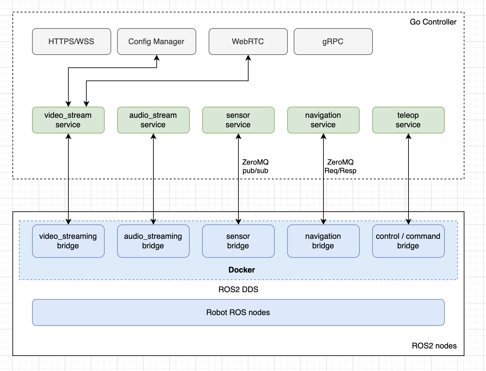

# Open-Teleop Platform Architecture Document

## 1. Overview

The Open-Teleop Platform is a distributed system designed to enable remote operation of robots by providing a standardized way to stream sensor data, video, and command information between robots and operators. The architecture consists of three main layers:

1. **Robot Layer** - The native ROS2 ecosystem running on the robot
2. **Bridge Layer** - A universal bridge that connects to ROS topics and forwards data
3. **Controller Layer** - A Go-based controller for processing messages and providing client APIs



### 1.1 Key Design Principles

- **Universal Bridge**: A single bridge component handles all ROS topics
- **Topic-Based Architecture**: System organized around topics rather than services
- **Priority-Based Processing**: Messages processed according to priority levels
- **Dynamic Message Handling**: Any ROS message format can be handled
- **Standardized Topic Naming**: Open-Teleop-Topic (OTT) naming convention

## 2. Component Architecture

### 2.1 Universal Bridge

The Universal Bridge is a single component that connects to the robot's ROS ecosystem and forwards messages to the controller.

#### 2.1.1 Topic Subscriber
- **Role**: Subscribes to configured ROS topics
- **Responsibilities**:
  - Dynamically subscribe to topics based on configuration
  - Receive ROS messages from the robot
  - Handle subscription lifecycle (connect, disconnect, reconnect)

#### 2.1.2 Message Converter
- **Role**: Converts ROS messages to OttMessages
- **Responsibilities**:
  - Wrap raw ROS message data in OttMessage format
  - Assign OTT identifiers based on configuration
  - Set appropriate priority levels
  - Add timestamp and version information

#### 2.1.3 ZeroMQ Client
- **Role**: Sends messages to the controller
- **Responsibilities**:
  - Maintain connection to controller
  - Serialize and send OttMessages
  - Handle connection failures and recovery

#### 2.1.4 Topic Publisher
- **Role**: Publishes messages to ROS topics
- **Responsibilities**:
  - Receive control commands from controller
  - Convert to appropriate ROS message format
  - Publish to configured ROS topics

#### 2.1.5 Config Processor
- **Role**: Manages bridge configuration
- **Responsibilities**:
  - Load and parse configuration
  - Apply topic mappings (ROS topic → OTT)
  - Handle dynamic configuration updates

### 2.2 Controller Layer

The Controller layer processes messages from the bridge and provides interfaces for clients.

#### 2.2.1 Message Processing

##### MessageReceiver
- **Role**: Receives messages from the Universal Bridge
- **Responsibilities**:
  - Maintain ZeroMQ server socket
  - Receive and deserialize OttMessages
  - Initial validation of messages
  - Forward to MessageDirector

##### MessageDirector
- **Role**: Routes messages based on priority
- **Responsibilities**:
  - Classify messages by priority level
  - Route to appropriate processing pool
  - Implement backpressure handling if needed
  - Track processing metrics

##### Processing Pools
- **Role**: Process messages according to priority
- **Types**:
  - **HighPriorityPool**: For video, audio, and critical data
  - **StandardPool**: For regular telemetry and sensor data
  - **LowPriorityPool**: For diagnostics and logs
- **Responsibilities**:
  - Maintain worker goroutines
  - Process messages by topic
  - Call ROS Parser for message decoding
  - Forward processed data to ConnectionManager

#### 2.2.2 Shared Services

##### RosParser
- **Role**: Parse raw ROS message data
- **Responsibilities**:
  - Implemented as a CGO component using rclcpp
  - Dynamically parse any ROS message format
  - Convert to Go-friendly data structures
  - Provide message introspection

##### TopicRegistry
- **Role**: Manage topic information
- **Responsibilities**:
  - Maintain registry of active topics
  - Store topic metadata
  - Track topic statistics
  - Manage topic handlers

#### 2.2.3 Client Communication

##### ConnectionManager
- **Role**: Route processed data to clients
- **Responsibilities**:
  - Track client subscriptions
  - Route data to appropriate protocol servers
  - Manage connection lifecycle
  - Implement delivery policies

##### SessionManager
- **Role**: Manage client sessions
- **Responsibilities**:
  - Authentication and authorization
  - Session creation and tracking
  - User management
  - Permission checking

##### Protocol Servers
- **Types**:
  - **WebRTCServer**: Video and audio streaming
  - **WebSocketServer**: Real-time data updates
  - **RESTServer**: Configuration and queries
  - **gRPCServer**: Service-to-service communication
- **Responsibilities**:
  - Maintain client connections
  - Implement protocol-specific logic
  - Deliver data to clients
  - Handle connection lifecycle

## 3. Data Flow

### 3.1 Uplink Path (Robot → Client)

1. **ROS Topic → Universal Bridge**:
   - Robot publishes data to ROS topics
   - Universal Bridge subscribes to configured topics
   - Raw messages received by Topic Subscriber

2. **Within Universal Bridge**:
   - Message Converter wraps raw data in OttMessage
   - OTT identifier assigned based on configuration
   - Priority level set based on topic configuration
   - ZeroMQ Client sends to controller

3. **Controller Processing**:
   - MessageReceiver receives OttMessage
   - MessageDirector routes to appropriate processing pool
   - Processing Pool calls RosParser if needed
   - Data processed according to topic type

4. **Client Delivery**:
   - Processed data sent to ConnectionManager
   - ConnectionManager routes to clients based on subscriptions
   - Appropriate protocol server delivers to client
   - Client displays or processes the data

### 3.2 Downlink Path (Client → Robot)

1. **Client → Protocol Server**:
   - Client sends command via appropriate protocol
   - Protocol Server receives and validates
   - Command forwarded to controller

2. **Controller Processing**:
   - Command processed and converted to appropriate format
   - Sent to Universal Bridge via ZeroMQ

3. **Universal Bridge → ROS**:
   - Command received by ZeroMQ Client
   - Converted to appropriate ROS message
   - Published to configured ROS topic
   - Robot receives and executes command

## 4. Message Format

### 4.1 OttMessage Format

The OttMessage is the standard message format for bridge-to-controller communication:

```
table OttMessage {
  // Schema version for future compatibility
  version:          uint8 = 1;
  
  // Core message content
  payload:          [ubyte];          // Raw message data
  content_type:     ContentType = ROS2_MESSAGE;
  
  // Single identifier from config
  ott:              string;           // Open-Teleop-Topic name
  
  // Priority information
  priority:         Priority = STANDARD;
  
  // Timing information
  timestamp_ns:     int64;           
}
```

### 4.2 Priority Levels

Messages are processed according to priority:

- **HIGH**: Real-time data requiring immediate processing
  - Examples: Video frames, audio samples, emergency status
  - Processed in dedicated high-performance pool
  - Minimal latency is the primary goal

- **STANDARD**: Regular telemetry and status updates
  - Examples: Sensor readings, position data, battery status
  - Processed in standard pool
  - Balance between throughput and latency

- **LOW**: Non-critical information
  - Examples: Diagnostics, logs, statistics
  - Processed when resources available
  - May be batched for efficiency

### 4.3 Open-Teleop-Topic (OTT) Specification

The OTT naming convention provides a standardized way to reference topics:

- **Format**: `teleop.[namespace].[message_name]`
- **Examples**:
  - `teleop.video.main_camera` - Main camera video feed
  - `teleop.sensor.battery` - Battery status
  - `teleop.control.arm` - Arm control commands

## 5. Client Interfaces

### 5.1 WebRTC

- Used for video and audio streaming
- Provides real-time, low-latency communication
- Peer-to-peer connection when possible

### 5.2 WebSocket

- Used for real-time telemetry and status updates
- Topic-based subscription model
- Bidirectional communication

### 5.3 REST API

- Used for configuration and system management
- Topic discovery and metadata
- Historical data queries
- Implemented using Fiber web framework

### 5.4 gRPC (Optional)

- Used for service-to-service communication
- High-performance, typed API
- Code generation for client SDKs

## 6. Design Decisions and Rationale

### 6.1 Universal Bridge vs Multiple Bridges

**Decision**: Use a single Universal Bridge instead of multiple specialized bridges.

**Rationale**:
- **Simplified Deployment**: Managing a single bridge is simpler than multiple bridges
- **Reduced Resource Usage**: Fewer processes, shared resources
- **No Artificial Boundaries**: Topics don't need to be categorized into specific bridges
- **Configuration-Driven**: New topics added via configuration, not code changes

### 6.2 Priority-Based Processing

**Decision**: Use priority levels to determine message processing.

**Rationale**:
- **Resource Allocation**: Critical data gets processing resources first
- **Latency Control**: High-priority messages have predictable latency
- **Graceful Degradation**: Under load, less critical data degraded first
- **Flexible Classification**: Priority assigned by configuration, not code

### 6.3 Topic-Based vs Service-Based Architecture

**Decision**: Organize around topics rather than services.

**Rationale**:
- **Natural Fit**: Aligns with ROS's topic-based communication model
- **Scalability**: Adding new topics doesn't require new code components
- **Flexibility**: Clients subscribe to exactly what they need
- **Future-Proof**: Can handle any message type, even unexpected ones

### 6.4 ROS Parser Implementation

**Decision**: Use CGO to implement ROS parsing in C++ and expose to Go.

**Rationale**:
- **Message Format Access**: C++ can directly use ROS message definitions
- **Dynamic Parsing**: Can parse any message format without prior knowledge
- **Performance**: Parsing in native C++ is more efficient
- **Reuse**: Leverages existing ROS libraries

### 6.5 ZeroMQ for Internal Communication

**Decision**: Use ZeroMQ for bridge-to-controller communication.

**Rationale**:
- **Performance**: High-throughput, low-latency messaging
- **Reliability**: Built-in reconnection and error handling
- **Flexibility**: Supports multiple messaging patterns
- **Language Agnostic**: Works with both Python (bridge) and Go (controller)

## 7. Future Development

### 7.1 ROS Parser CGO Implementation

A key next step is implementing the ROS Parser CGO component, which will:
- Use rclcpp to parse ROS messages
- Provide a C interface for Go to call
- Dynamically handle any ROS message type
- Convert between ROS and Go data structures

### 7.2 Configuration Management

Develop a robust configuration system that:
- Defines topic mappings (ROS topic → OTT)
- Sets priority levels
- Supports dynamic updates
- Provides validation and error checking

### 7.3 Web UI

Create a web-based user interface that:
- Displays video feeds
- Visualizes sensor data
- Provides control interfaces
- Manages system configuration

### 7.4 Cloud Integration

Extend the system to integrate with cloud services:
- Data storage and analytics
- Remote monitoring
- Fleet management
- Multi-robot coordination