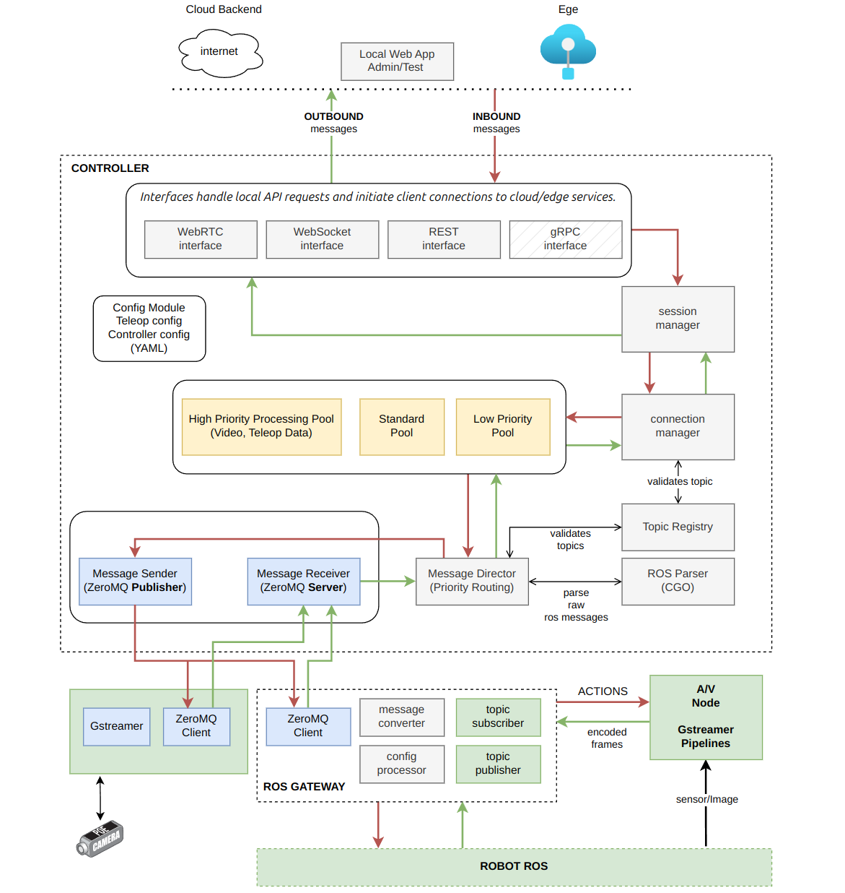

# Open-Teleop Platform Architecture Document

## 1. Overview

The Open-Teleop Platform is a distributed system designed to enable remote operation of robots by providing a standardized way to stream sensor data, video, and command information between robots and operators. The architecture consists of three main components:

1. **Robot ROS Nodes** - The native ROS2 ecosystem running on the robot
2. **Bridge Nodes Container** - Python/C++ bridges that connect to ROS topics and forward data
3. **Controller Container** - Go-based services that process data and provide APIs

### 1.1 Key Components

## 2. Component Descriptions

### 2.1 Robot ROS Nodes

The bottom layer representing the robot's native ROS2 ecosystem. These nodes publish data on various topics that provide information about the robot's state, sensor readings, camera feeds, etc.

- Publishes data on standard or robot-specific ROS topics
- Subscribes to command topics for teleoperation
- Operates independently of the teleop platform

### 2.2 Bridge Nodes Container (Python/C++)

Bridges connect to the robot's ROS topics and forward raw message data to the Controller. Each bridge specializes in a specific data type:

- **video_streaming_bridge**: Handles camera/video data from the robot
- **audio_streaming_bridge**: Manages audio streams from the robot
- **sensor_bridge**: Collects sensor data (lidar, IMU, etc.)
- **navigation_bridge**: Processes navigation and position information
- **teleop_bridge**: Manages command and control data
- **system_diagnostics_bridge**: Collects system diagnostics information

Bridges operate by:
1. Subscribing to specific ROS topics
2. Serializing the raw ROS message data
3. Forwarding the data via ZeroMQ/flatbuffer to the corresponding service in the Controller
4. Not performing any parsing or transformation of message structure

### 2.3 Controller Container (Go)

The Go Controller contains multiple components that work together to process, transform, and deliver robot data:

#### 2.3.1 Service Layer

- **video_stream_service**: Handles video data for streaming to clients
- **audio_stream_service**: Manages audio streaming
- **sensor_service**: Processes sensor data
- **navigation_service**: Manages navigation information
- **teleop_service**: Handles command and control operations
- **system_diagnostics_service**: Processes system diagnostic data

#### 2.3.2 API Layer

- **WebRTC**: Manages real-time video/audio streaming to clients
- **gRPC**: Provides efficient service-to-service communication
- **HTTPS/WSS**: Handles web client connections and WebSocket communication
- **Config Manager**: Manages system configuration, including robot topic mappings

#### 2.3.3 ROS Parser CGO (New Component)

A C++ component integrated into the Go controller via CGO (cgo - Go's foreign function interface) that:
- Uses rclcpp library to parse any ROS message format
- Does not require the controller to be a ROS node
- Allows the system to handle any ROS message type without prior knowledge of its structure
- Converts parsed message data into a format usable by Go services

## 3. Data Flow

### 3.1 Ingestion Path

1. **Robot → Bridge**:
   - Robot ROS nodes publish data on various topics
   - Bridge nodes subscribe to relevant topics
   - Raw messages flow from robot nodes to bridges via ROS DDS

2. **Bridge → Service**:
   - Bridges forward raw message data using ZeroMQ/flatbuffer
   - Raw message includes topic name, message type, and serialized data
   - No transformation of message structure at this stage

3. **Service → Parser**:
   - Go services receive raw ROS message data
   - Services pass raw data to the ROS Parser CGO component
   - Parser uses rclcpp to introspect and parse the message structure

4. **Parser → OTT Conversion**:
   - Parsed structured data is converted to OTT (Open-Teleop-Topic) format
   - OTT provides a consistent naming convention:
     - Standard ROS messages: `teleop.{package}.{message}` (e.g., `teleop.sensor.battery_state`)
     - Custom messages: `teleop.custom.{package}.{message}` (e.g., `teleop.custom.acme_msgs.robot_status`)

5. **Service Processing**:
   - Services use the OTT-formatted data for:
     - Streaming to clients (video/audio)
     - Visualization in web UI
     - Cloud ingestion
     - Monitoring and analytics

### 3.2 Command Path

1. **Client → HTTPS/WSS → Service**:
   - Web clients send commands via HTTP or WebSocket
   - Commands are received by appropriate services

2. **Service → Bridge**:
   - Services format commands for robot consumption
   - Commands sent to bridges via ZeroMQ Req/Resp pattern

3. **Bridge → Robot**:
   - Bridges publish commands to appropriate ROS topics
   - Robot nodes subscribe to and execute commands

## 4. Topic Discovery and Configuration

### 4.1 Topic Discovery

1. When connecting to a new robot, the system discovers available ROS topics
2. Topic information (name, message type) is presented to users via the web UI
3. Users select which topics they want to monitor/control

### 4.2 Configuration Management

The Config Manager:
1. Stores the mapping between robot topics and services
2. Configures bridges to subscribe to selected topics
3. Provides configuration to services for processing specific data types
4. No manual mapping needed for message fields due to the C++ parser capability

## 5. Open-Teleop-Topic (OTT) Specification

The OTT naming convention provides a standardized way to reference data types in the system:

- **Format**: `teleop.[namespace].[message_name]`
- **Standard ROS Messages**:
  - `sensor_msgs/BatteryState` → `teleop.sensor.battery_state`
  - `sensor_msgs/Image` → `teleop.sensor.image`
  - `nav_msgs/Odometry` → `teleop.nav.odometry`

- **Custom Messages**:
  - `acme_msgs/RobotStatus` → `teleop.custom.acme_msgs.robot_status`
  - `foo/Bar` → `teleop.custom.foo.bar`

This algorithmic conversion requires no manual mapping and scales to any message type.

## 6. C++ Parser Integration

### 6.1 Parser Implementation

The C++ Parser component:
- Uses rclcpp for message introspection without being a full ROS node
- Provides a C-compatible API for integration with Go via CGO
- Dynamically handles any ROS message type
- Returns structured data that Go can work with

### 6.2 Go Integration

- Go services call the parser via CGO bindings
- Parsed data is converted to Go-friendly structures
- Services can access message fields without prior knowledge of structure
- Data is then processed according to service-specific needs

## 7. Benefits of This Architecture

1. **Flexibility**: Can handle any ROS message type from any robot
2. **Scalability**: No manual mapping required for new message types
3. **Performance**: Efficient parsing of ROS messages in native C++
4. **Maintainability**: Clean separation of concerns between components
5. **Extensibility**: New services can be added without changing the core architecture
6. **Interoperability**: Works with any ROS2-based robot